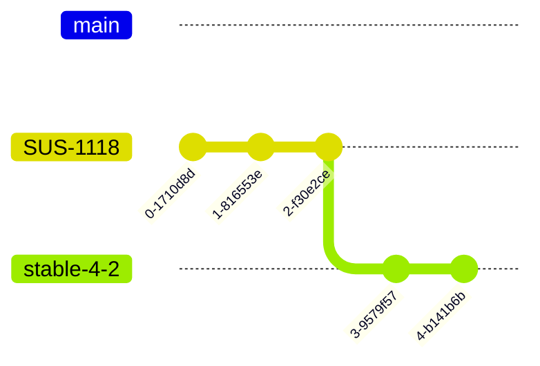

# mermaid_syntax
Repositório para melhor compreensão de mermaid, que pode ser útil para diagramação em documentos markdown

# Git Graph

```mermaid
    gitGraph
       branch SUS-1118
       commit
       commit
       commit
       branch stable-4-2
       commit
       commit
```
