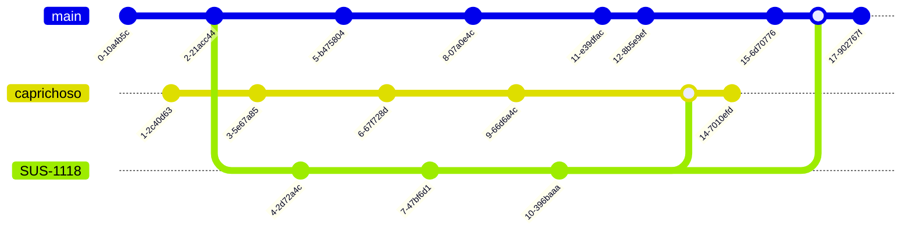

# mermaid_syntax
Repositório para melhor compreensão de mermaid, que pode ser útil para diagramação em documentos markdown

>[Official ***Mermaid*** website](https://mermaid.js.org/intro/)

# Git Graph

